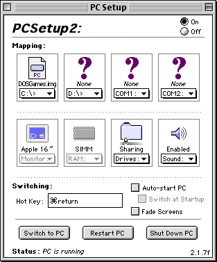
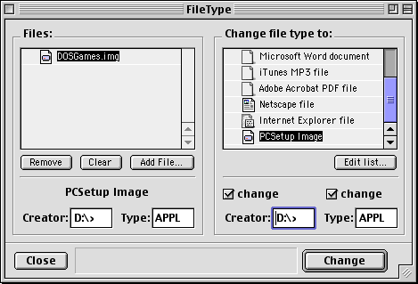

# classicmac-pcsetup-kit

This script creates image files suitable for the [DOS/Windows/PC compatibility cards](http://www.oliver-schubert.com/DOScard/DOScard.html) in classic Macs. It creates image files that are readable and bootable by [PC Setup](http://www.oliver-schubert.com/DOScard/DOScard.html#pcsetup2x) (in case your floppy drive is dead like mine was).

Developed and tested on Ubuntu 18.04 and PowerMac 6100, 264 MB RAM, OS 9.1, NuBus PC compatibility card, Cyrix 486 DX2 66, 32 MB RAM, PC Setup 2.1.7f only

## Image format

The image files produced by the PC Setup Mac app are in raw format, however there is a catch: they have to be properly addressed with the correct disk geometry parameters to get working and bootable images files.

The [CHS](https://en.wikipedia.org/wiki/Cylinder-head-sector) disk geometry parameters of the emulated SCSI drive are:

    Cylinders = size of image in MB
    Heads = 64
    Sectors = 32

The first partition starts at sector 32 instead of sector 63 or 2048 of more modern systems.

This is the main culprit when trying to install DOS or Windows in a virtual machine: The VM also has to emulate the same disk geometry that the emulated SCSI drive of the PC Setup software is using. Failing to do so will result in the disk simply not booting due to the wrong disk geometry parameters saved in the MBR and boot sector by the DOS/Windows setup.

## VirtualBox

Most modern software have already removed support for the ancient CHS disk geometry. For instance I was not able to get bootable images with qemu. However, trusty VirtualBox to the rescue.

The pcsetup-kit script will automatically create a .vmdk adapter file that can be used as drive image in VirtualBox. Simply create a new virtual machine in VirtualBox and make sure to select `DOS` or `Windows 95/98` as machine type and configure it similar to your PC compatibility card.

Once the image is finished, copy it over to your Mac or mount the image via AFP. Make sure to change the filetype to Creator: "D:>" and Type: "APPL", so the image file will be selectable in the PC Setup app. For details see [Using images on the Mac](#using-images-on-the-mac) below.

## Usage

    $ ./pcsetup-kit.sh
    Usage: ./pcsetup-kit.sh ACTION ...

    ACTIONs:
         create  -  Create a new image file
        adapter  -  Create a VMDK adapter for an existing image file

### Creating an image

    $ ./pcsetup-kit.sh create
    Usage: ./pcsetup-kit.sh create (PCSetup image filename) (Size In MB) [options]

    Options:
        --no-partiioning   Only create image file. Do not create partitions in image.
        --no-format        Do not format image file.
        --preseed          Copy files in files sub-directory to image.
        --no-vmdk-file     Do not create an VMDK adapter file for Virtual Box or VMware.

If you wish to create an image with VMDK-adapter file that is not initialized:

    $ ./pcsetup-kit.sh create DOSStartImage.img 500 --no-partitioning

This command produces a 500 MB raw image file `DOSStartImage.img` that can be used with PC Setup on the Mac. It also creates a VMDK adapter file `DOSStartImage.img.vmdk` which can be used as disk image in VirtualBox and likely VMware (untested).

`--no-partitioning` makes sure to not create a partition table and force the OS setup to deal with partitioning. When the partition table is prepared beforehand, MS-DOS will most likely not boot, since the MS-DOS installer skips the steps to install the MBR and boot sector.

### Creating an VMDK adapter file from an existing image

    $ ./pcsetup-kit.sh adapter
    Usage: ./pcsetup-kit.sh adapter [PCSetup image filename]

If you wish to boot your already existing image file create by PC Setup on the Mac, you need an VMDK adapter file in order to use the image as disk image in VirutalBox.

    $ ./pcsetup-kit.sh adapter "My Windows 95 setup.img"

This will create the adapter file `My Windows 95 setup.img.vmdk`.

### Using images on the Mac

In order to make our created image files selectable in the PC Setup application, we need to change the resource fork information of the image to the proper Mac file type.
This can be achieved using the app [FileType](http://www.frederikseiffert.de/filetype/). Creator: "D:>" and Type: "APPL"

